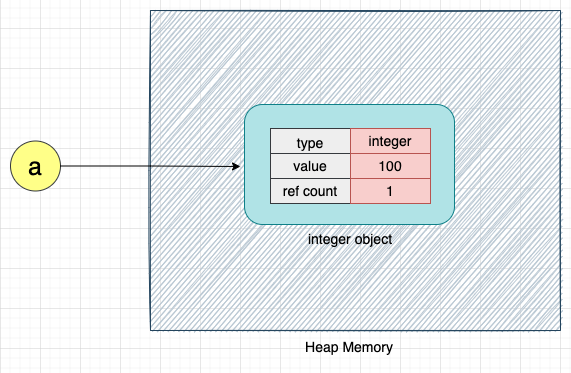
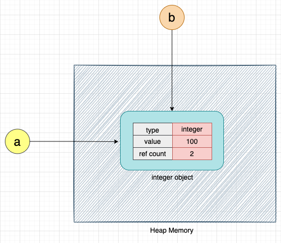
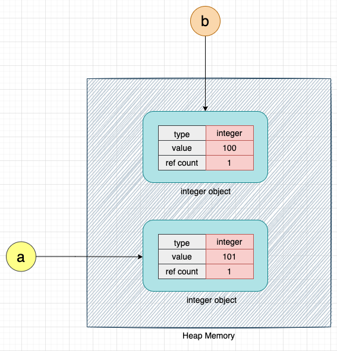
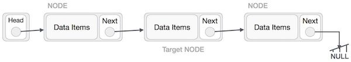

# Lab06 - Lista Encadeada

## Conceitos:

**Listas encadeadas** são estruturas de dados lineares, de acesso sequencial. Essas estruturas se valem do processo de **alocação dinâmica de memória** para garantir que operações de alteração da estrutura, tais como inserção e remoção, sejam implementadas com o mínimo de operações de trocas entre seus elementos.

Para alcançar esse objetivo, a lista encadeada armazena explicitamente as relações de sucessor e/ou predecessor em um **TAD** denominado `Nó`. É nesse objeto que o encadeamento com o próximo[^1] elemento da lista será armazenado. A Figura 1 representa graficamente esse conceito de *Nó*. 

.

*Figura 1 - Representação gráfica do **TAD** `Nó`.*

Em *Python* esse **TAD** será representado por uma classe como na listagem abaixo.

    class cNo:

        def __init__(self, dado=None):

            self.__dado__ = dado
            self.__prox__ = None
        
    # *******************************************************
    # *******************************************************
        def __str__(self):

        outStr = ""
        outStr +=  "+======+=================+\n"
        outStr += f'| {self.__dado__:4} | {id(self.__prox__)} |\n'
        outStr +=  "+======+=================+\n"
        return outStr

    # *******************************************************
    # *******************************************************
        def setDado(self, dado):
            self.__dado__ = dado 

    # *******************************************************
    # *******************************************************
        def setProx(self, prox):
            self.__prox__ = prox

    # *******************************************************
    # *******************************************************
        def getDado(self):
            return self.__dado__

    # *******************************************************
    # *******************************************************
        def getProx(self):
            return self.__prox__

Um `Nó` representa a estrutura base de uma Lista. Seus métodos lidam apenas com sua visualização, obtenção e modificação de seus atributos. Portanto, fica claro que um `Nó` não é capaz de gerenciar outros `Nós`. 

Para isso, outro **TAD** é necessário: a **Lista Encadeada** propriamente dita. A `Lista` será responsável por criar e garantir a integridade das relações de conectividade entre os `Nós`. Na Figura 2 podemos ver como esses dois **TADs**, `Nó` e `Lista` se relacionam. Cada `Nó` armazena o dado e o encadeamento com seu sucessor; enquanto a `Lista` caberá gerenciar esses encadeamentos. 

*Figura 2 - Representação gráfica do **TAD** Lista Encadeada.*

É importante notar que o **TAD** `Lista` não precisa armazenar os `Nós` explicitamente dentro de sua estrutura (como acontece com um vetor). O principio da `Lista Encadeada` é que os `Nós` são criados sob demanda, ou seja, alocados individualmente e em tempos diferentes. E que são relacionados na estrutura de dados a partir dos seus encademantos (atributo `prox` do `Nó`).

Podemos então criar um **TAD** `Lista` com o seguinte código *Python*

    class cLSE:     # LSE -> Lista Simplesmente Encadeada

        def __init__(self):
            self.__inicio__     = None
            self.__numElems__   = 0

O atributo `__inicio__` registra o primeiro `Nó` da `Lista`. Os demais nós serão encontrados seguindo o encadeamento de cada um. 

Vejamos um exemplo de como esse processo pode ser feito avaliando o método de percurso da `class cLSE`:

    def percorreLista(self):

        if self.__inicio__ == None:                 # Se a lista esta vazia o inicio é None
            return

        noCorrente = self.__inicio__                # noCorrente recebe a referencia para o
                                                    # primeio Nó da lista
        
        while noCorrente != None:                   # Por convenção o ultimo Nó aponta para None
            print(noCorrente.getDado())             # imprime o valor do dado armazenado no Nó apontado por noCorrente
            noCorrente = noCorrente.getProx()       # segue o encadeamento para o proximo Nó

A próxima questão a ser definida é como criaremos `Nós` para colocar na `Lista` ?

Em *Python* a alocação dinâmica é feita a todo o momento, uma vez que a declaração de uma nova variável equivale a uma nova alocação de memória na área de *Heap*. Portanto, o encadeamento pode ser conseguido de uma forma bem simples: o conteúdo de uma variável receber outra variável equivale a criar uma **referência** a mesma área de memória. O exemplo a seguir e a Figura 3 mostram essa ligação. 

    Python 3.10.6 (main, Aug 10 2022, 11:40:04) [GCC 11.3.0] on linux
    Type "help", "copyright", "credits" or "license" for more information.
    >>> a = 100
    >>> b = a
    >>> print(a,b)
    100 100
    >>> print(id(a), id(b))
    140102105664848 140102105664848
    >>> a = a + 1
    >>> print(a,b)
    101 100
    >>> print(id(a), id(b))
    140102105664880 140102105664848

*Figura 3 - Variável a; b sendo uma referencia para a; uma nova alocação criada pelo incremento de a.*

O que acontece em termos de alocação de memória nas linhas do exemplo acima é:

    a = 100     # malloc(a)
    b = a       # b = referencia para a
    a = a + 1   # malloc(a+1) ; a = referencia para (a+1) ; reduzir o ref.count de b

Podemos ter diversas variáveis ou atributos de classes apontando para o mesmo objeto (repare que o campo *reference count* dos objetos na Figura 3 registra esse fato), mas quando modificamos o valor de uma das variáveis uma nova alocação é criada. Esse processo está bem detalhado em [1], sugiro fortemente a sua leitura.

Portanto, para a criação dos encadeamentos entre `Nós`, precisamos colocar no atributo `prox` de um `Nó` o valor da referência (endereço de memória) de outro `Nó`. Como fazer isso? É simples: Considere a `Lista` da Figura 4. A criação de um novo `No` pode ser feita pelo seguinte código em *Python*:

    novoNo = cNo.cNo(n)     # invoca o contrutor de cNo e inicializa seu __dado__ com n
                            # o atributo __prox__ é inicializado com None.

*Figura 4 - Operação de **inserção**. Primeiro passo: criar um novo nó.*

O próximo passo é criar um encadeamento do `novoNo` com um `Nó` da lista, como mostra a Figura 5. Em uma inserção genérica, o local de entrada do `novoNo` será definido por 2 `Nós`, chamados aqui de `noAnterior` e `noCorrente`. Ou seja, o `novovNo` deve ser colocado **depois** do `noAnterior`e **antes** do `noCorrente`. Para ligar o `novoNo` ao `nóCorrente` temos:

    novoNo.setProx(noCorrente)    # Cria o encadeamento de novoNo para um Nó da lista.

*Figura 5 - Operação de **inserção**. Segundo passo: criar o encadeamento do novo `Nó` à `Lista`.*

Na sequencia para conectar a lista ao `novoNo`, criamos uma ligação entre o `noAnterior` e o `novoNo`, como mostra a Figura 6. Em *Python* temos:

    noAnterior.setProx(noCorrente.getProx())    # Liga o noAnterior da Lista ao novoNo.

*Figura 6 - Operação de **inserção**. Terceiro passo: criar o encadeamento de um dos `Nós` da `Lista` ao novo `Nó`.*

Ao final desse processo temos o `novoNo` encadeado aos elementos da `Lista`, como mostra a Figura 7.

*Figura 7 - Configuração final da `Lista` após a inserção do nov `Nó`. *

Esse conceito, de "andar" nos elementos da lista pelos seus encadeamentos (descrito no processo de percurso) e o mecanismo de modificações dos encadeamentos dos `Nós` mostrado no exemplo acima, permitirão a implementação das operações básicas de uma `Lista`. A Figura 8 mostra graficamente a sequencia de passos necessários para a remoção de um `No` de uma `Lista`[^2]. 

*Figura 8 - Operação de **remoção**. Envolve os passos de: localizar o `Nó` a ser removido (*targetNode*); fazer com que o `Nó` que apontava para ele aponte para seu próximo; a remoção da referencia do nó a ser removido para um elemento da `Lista`, e finalmente a remoção da área de memória por ele ocupada.*

## Atividades do Laboratório

Antes de começar a codificar assegure-se que voce entendeu o processo descrito acima e analisou com cuidado o código base fornecido pelo professor. 

Sua atividade será implementar os métodos da classe `cLSE`:

    def getTamanho(self):       # retorna o numero de nós da lista

    def __str__(self):          # saida formatada de todos os elementos da lista

    def insereNo(self, n):      # dado o valor n criar um novo nó a ser inserido no final da lista

    def buscaDado(self, n):     # procura pela primeira ocorrencia do valor n na lista, se existir

    def removeNo(self, n):      # caso o valor n esteja na lista, remover seu nó

O programa `mainLSE.py` já fornece uma estrutura para teste dessas funções. Atualmente como todas os métodos estão "vazios" a lista permanece sempre "vazia". Portanto, começe pelo método `insereNo`. Mãos à obra!!

## Referências Bibliográficas:

[1]  Rupesh Mishra, **Memory Management in Python**. Disponível em: https://www.honeybadger.io/blog/memory-management-in-python/

[2] Cormen,T.H., Leiserson,C.E., Rivest,R.L., Stein,C. Algoritmos – Teoria e Prática. Editora Campus. 3a Edição, 2012..

[3] Canning, J., Broder, A., Lafore, R. Data Structures & Algorithms in Python. Addison-Wesley. 2022.

[^1]: Existem outros tipos de lista que podem armazenar outros encadeamentos. No momento estamos interessados apenas em representar a relação de sucessão. Por isso esse tipo de lista é chamado de **Lista Simplesmente Encadeada**
[^2]: Perceba que casos especiais (e se a lista estiver vazia?, por exemplo) não foram tratados nessa ideia geral dos procedimentos, mas deverão ser considerados em uma implementação completa. 
