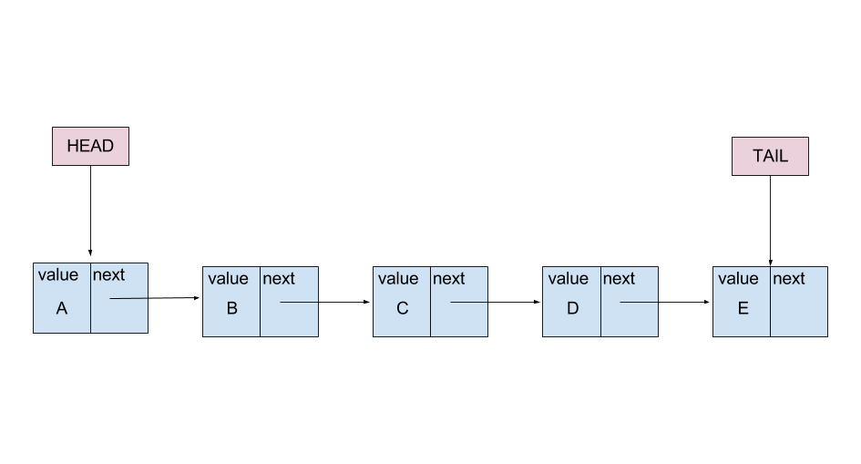
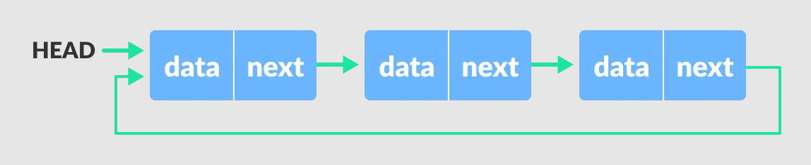

# Lab07 - Listas Encadeadas e suas Variantes

Nas última aulas a estrutura básica do **TAD** *Lista Encadeada* foi apresentada e discutida. 

Na verdade estudamos a varianta mais simples de `Lista`: *Lista Simplesmente Encadeada* ou *LSE*. Nessa forma, cada nó da `Lista` armazena apenas uma referência para o próximo `No` da *LSE*, como mostra a Figura 1.  

*Figura 1 - Lista Simplemente Encadeada.*

No entanto, essa não é a única forma de se implementar um **TAD** *Lista Encadeada*. Diversas "variantes" podem ser criadas, com o objetivo de tornar algumas operações mais simples, ou mesmo se adequar a problemas com restrições específicas. 

O objetivo dessa atividade de Lab é implementar e analisar as principais "variantes" de uma *Lista Simplesmente Encadeada*. 

Considere para essa atividade o código fonte fornecido nesse Lab, que implementa uma *Lista Simplesmente Encadeada* `LSE`:

1. Contendo valores inteiros em seus `Nós`, e que
2. Possui as seguintes operações básicas:
    * Criar[^1] a lista (vazia);
    * Inserir uma nova chave (no final da lista);
    * Buscar uma chave;
    * Remover uma chave da lista;
    * Imprimir todas as chaves da lista; e
    * Destruir[^1] a lista (que implica na destruição de todos os `Nós` associados à lista).

Na implementação das variantes, voce deve se preocupar em avaliar o que muda na complexidade das 3 operações críticas da `LSE`: *Inserção*, *Remoção* e *Busca*. 

Vamos lá!

## I - Lista Simplesmente Encadeada (LSE) com referencias aos dois extremos:

Implemente uma variante da `LSE` incluindo um ponteiro para o ultimo nó da lista, como na Figura 2. 

*Figura 2 - Lista Simplemente Encadeada com ponteiros para o inicio e fim da lista.* 

## II - Lista Simplesmente Encadeada Ordenada (LSEO):

Condifique a variante **LSEO** na qual os elementos são mantidos na lista de forma ordenada, ou seja, as chaves ocupam posições na lista segundo uma ordenação crescente[^2]. Portanto, pelo menos a operação de inserçao deve ser modificada para satisfazer esse novo padrão de organização dos `Nós` na `Lista`. Outras operações precisarão ser modificadas? Em caso afirmativo, faça as mundanças necessárias. 

Modifique o método de impressão da `LSEO` para que seus `Nós` possam ser impressos em ordem normal ou em ordem reversa[^3].
    
## III - Lista Duplamente Encadeada (LDE):

Até o momento, as variantes resultaram em mudanças na estrutura e/ou métodos da `Lista`. 

Considere agora uma mudança na estrutura do `Nó`: incluir um segundo encadeamento que permita registrar o predecessor do `Nó`. Ou seja, cada `Nó` conterá um duplo encadeamento, como mostra a Figura 3.

*Figura 3 - Exemplo de uma Lista Duplamente Encadeada.*

Implemente a **LDE** mantendo a versão ordenada das chaves na `Lista`. 

Avalie como a introdução desse segundo encadeamento tornam as operações na lista mais simples ou mais complexas. 
  
## IV - Lista Circular (LC):

Uma lista circular se caracteriza pelo ultimo nó da lista apontar não mais para uma referencia `None` mas sim para o primeiro elemento, fechando um ciclo, como mostra a Figura 4.

*Figura 4 - Exemplo de uma Lista Duplamente Encadeada Circular.* 

Escolha uma das variantes anteriormente codificadas e implemente uma versão circular dessa `Lista`.

Analise o que se ganha e o que se perde nesse tipo de lista em relação à `Lista` original escolhida.

## Bibliografia:

T.H.Cormen, C.E.Leiserson, R.L.Rivest, C.Stein. **Algoritmos – Teoria e Prática**. Editora Campus. 3a Edição, 2012.

Canning, J., Broder, A., Lafore, R. Data Structures & Algorithms in Python. Addison-Wesley. 2022.

[^1]: Lembre-se que ao criar ou destruir um objeto de uma classe, o construtor (`__init__`) e o destrutor (`__del__`) da classe são, respectivamente, invocados.

[^2]: Considere uma `LSEO` que suporte ordenação crescente e decrescente, definida através de seu construtor. 

[^3]: Podem ser dois métodos distintos ou o mesmo método onde uma "flag" determina o sentido de impressão desejado. 