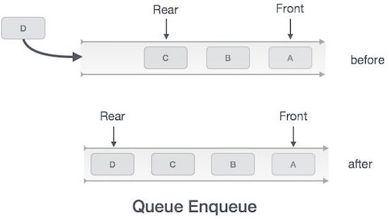

# Lab08 - Pilha e Fila

## Conceitos:

**Pilhas** e **Filas** são tipos de organizações que utilizamos no nosso dia-a-dia. Nas Figuras 1 e 2 podemos ver, respectivamente, exemplos de pilhas (de cartas e de pratos :unamused:) e fila (de carros em um engarrafamento :disappointed:).      

*Figura 1 - Exemplos concretos de Pilha. Fonte: https://www.tutorialspoint.com/data_structures_algorithms/stack_algorithm.htm*

*Figura 2 - Exemplos concretos de Fila. Fonte: https://www.tutorialspoint.com/data_structures_algorithms/dsa_queue.htm*

Sabemos pela experiência que essas duas organizações possuem regras de entrada e saída distintas, e que não devem ser quebradas. 

Em um **Fila** de banco ou supermercado, a boa educação recomenda que você entre no final da fila, e aguarde o atendimento de todos os clientes que estão a sua frente. O atendimento é sempre feito iniciando do primeiro cliente que entrou na fila até o último. É o que mostra a Figura 3.

*Figura 3 - Conceito de Fila. Fonte: https://www.tutorialspoint.com/data_structures_algorithms/dsa_queue.htm*

De mesma forma, quando criamos uma **Pilha** de objetos sabemos que forma mais simples de colocar novos objetos é na parte de cima da pilha. E para retirarmos um objeto, sem correr o risco de derrubar a pilha, também utilizamos a parte de cima da pilha. 

*Figura 4 - Conceito de Pilha. Fonte: https://www.tutorialspoint.com/data_structures_algorithms/stack_algorithm.htm*

As duas organizações guardam uma relação de linearidade entre seus elementos, tal como as estruturas de **Vetores** e **Listas** já estudadas anteriormente. No entanto, suas operações são mais restritivas que aquelas disponíveis nessas outras estruturas. 

Podemos perceber claramente que exite uma relação temporal no processo de entrada e saída de elementos das duas organizações: 
  * Na **Fila** o primeiro elemento a entrar é sempre o primeiro elemento a sair. A essa regra damos o nome de "Primeiro a Entrar, Primeiro a Sair" ou na versão em inglês "*First In, First Out*" ou *FIFO*. 
  * Na **Pilha** o último elemento a entrar é o primeiro elemento a sair. Essa política chamamos de "Ultimo a Entrar, Primeiro a Sair", ou em inglês "*Last In, First Out*" ou "*LIFO*".

Dessa forma, a implementação dos **TADs** **Pilha** e **Fila** deverá ter como requisito base garantir que as regras *LIFO* e *FIFO*, respectivamente, sejam respeitadas.

## Pilha

A implementação de um **TAD Pilha** deve possuir as seguintes operações:
  * **Criar** uma pilha vazia;
  * **Empilhar** um novo elemento (*Push*);
  * **Desempilhar** um elemento (*Pop*);
  * Verificar se a pilha **está vazia**.

Operações mais genéricas como busca, remoção e impressão não são necessárias. 

Nas Figuras 5 e 6 podemos observar, respectivamente, o funcionamento das operações de **Empilhar** e **Desempilhar**. Vale notar que essas operações são executadas sempre em relação ao **topo** da pilha. Portanto, a localização dessa posição na estrutura deve ser mantida.   

*Figura 5 - Pilha: Operação de empilhar. Fonte: https://www.tutorialspoint.com/data_structures_algorithms/stack_algorithm.htm*

*Figura 6 - Pilha: Operação de desempilhar. Fonte: https://www.tutorialspoint.com/data_structures_algorithms/stack_algorithm.htm*

## Fila

A implementação de um **TAD Fila** deve possuir as seguintes operações:
  * **Criar** uma fila vazia;
  * **Enfileirar** um novo elemento (*Enqueue*);
  * **Desenfileirar** um elemento (*Dequeue*);
  * Verificar se a fila **está vazia**.

Tal como na **Pilha**, operações mais genéricas como busca, remoção e impressão não são necessárias.

Nas Figuras 7 e 8 podemos observar, respectivamente, o funcionamento das operações de **Enfileirar** e **Desenfileirar**. Nesse caso, podemos notar que as duas extremidades da estrutura, seu inicio e seu final, devem ser mantidos, de tal sorte a garantir a politica "*FIFO".   

*Figura 7 - Fila: Operação de enfileirar. Fonte: https://www.tutorialspoint.com/data_structures_algorithms/dsa_queue.htm*

*Figura 8 - Fila: Operação de enfileirar. Fonte: https://www.tutorialspoint.com/data_structures_algorithms/dsa_queue.htm*

## A Atividade do Lab:

Como já mencionamos, os dois **TADs**, **Pilha** e **Fila**, tem como característica básica uma organização linear e sequencial dos elementos nas estruturas. 

1. Considerando que voce já conhece duas estruturas lineares e sequenciais, os **Vetores** e as **Listas Encadeadas**[^1], analise as características de cada uma das duas estruturas e defina qual desses **TADs** você considera mais apropriado para a implementação de uma **Pilha** e uma **Fila**.
2. Com base na escolha feita no item 1, codifique, em Python, os **TADs** **Pilha** e **Fila**, utilizando o conceito de modularização.
3. Codifique um (ou dois) programas de teste que promovam a manipulação das duas estruturas e que permitam verificar se as politicas "*FIFO*" e "*LIFO*" estão sendo respeitadas. 
4. Após testar seus **TADs**, analise a complexidade de suas operações. 

## Bibliografia:

T.H.Cormen, C.E.Leiserson, R.L.Rivest, C.Stein. **Algoritmos – Teoria e Prática**. Editora Campus. 3a Edição, 2012.

Canning, J., Broder, A., Lafore, R. Data Structures & Algorithms in Python. Addison-Wesley. 2022.

[^1]: Considere aqui todas as variantes de **Listas Encadeadas**
