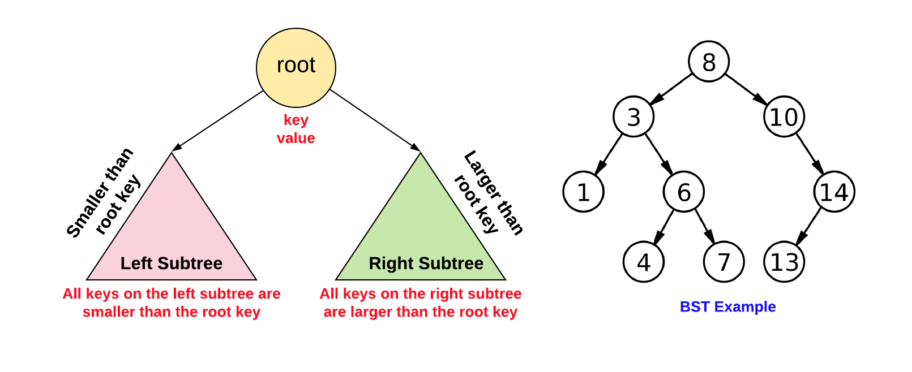
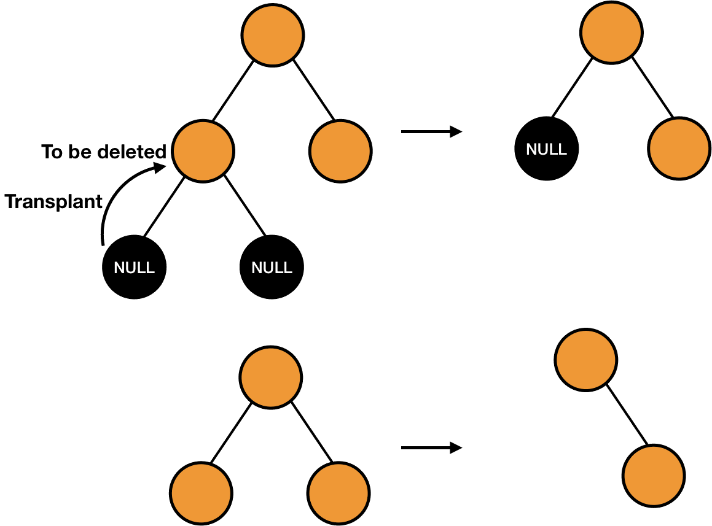
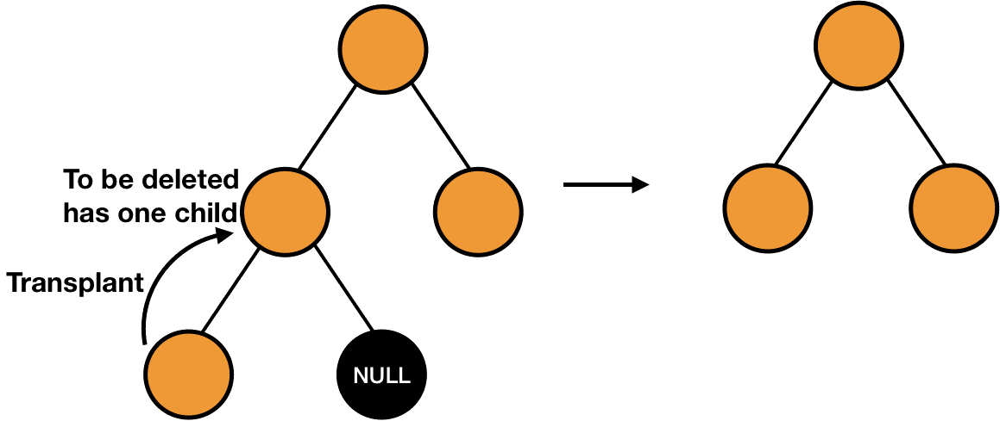
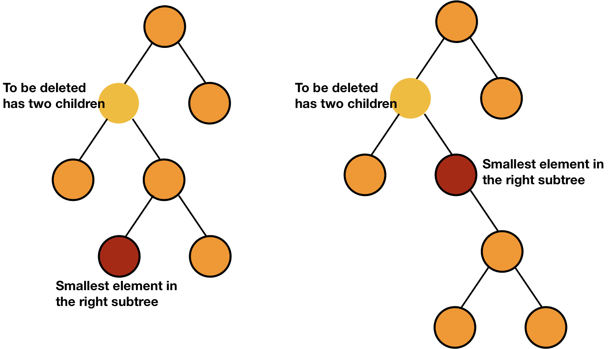

# Lab10 - Árvore Binária de Busca (ABB)

Uma árvore para ser denominada **binária de busca** deve satisfazer a relação apontada na Figura 1, para todas as raízes de todas as suas sub-árvore. 

*Figura 1 - Árvore Binária de Busca.*

## Construção de uma ABB

O processo de construção segue um algoritmo bastante simples: procurar uma sub-árvore vazia e nela criar uma raiz com a chave a ser inserida. A Figura 2 ilustra esse processo. 

*Figura 2 - inserção em um Árvore Binária de Busca.*

## Busca de uma chave em uma ABB

O processo de busca por uma chave na **ABB** usa a sua definição como guia. Para cada sub-árvore avalia se a chave da sua raiz é a chave procurada, e caso não seja direciona a busca para a sub-árvore onde a chave pode estar. A Figura 3 ilustra esse processo. 

*Figura 3 - Busca por uma chave em uma Árvore Binária de Busca.*

## Remoção de uma chave de uma ABB

O processo de remoção de uma chave na **ABB** é o processo mais trabalhos pois envolve duas etapas: busca da chave e a remoção propriamente dita. 

Uma vez encontrada a chave, a remoção precisa analisar 3 casos, como mostra a Figura 4. No mais simples a chave localiza-se em um nó folha, e sua remoção é feita simplesmente fazendo seu pai apontar para uma referencia nula. O segundo caso, o nó que contem a chave possui uma sub-árvore associada. Nesse caso basta substituir o nó da chave pela raiz da única sub-árvore a ele associada.

Por fim, o caso mais complexo e geral é quando o nó que contem a chave a ser removida possui duas sub-árvores associadas. Nesse caso, a solução é busca um outro nó, cuja chave possa substituir a chave do nó a ser removido, mantendo a condição de **ABB**, e que se enquadre em um dos casos anteriores (nó folha ou com apenas uma sub-árvore), mais fáceis de resolver.  

Analise com cuidado: qual chave pode fazer a substituição no 3o. caso, mantendo a condição de **ABB** e que garantidamente é um nó em situação de remoção mais simples? 

*Figura 4 - Os 3 casos de remoção de uma chave em uma Árvore Binária de Busca.*

## A atividade

A partir das descrições das 3 operações básicas de uma árvore, **inserção**, **busca** e **remoção**, implemente-as no código base fornecido nesse Lab.

# Referências Bibliográficas:

Cormen,T.H., Leiserson,C.E., Rivest,R.L., Stein,C. **Algoritmos – Teoria e Prática**. Editora Campus. 3a Edição, 2012..

Canning, J., Broder, A., Lafore, R. **Data Structures & Algorithms in Python**. Addison-Wesley. 2022.

