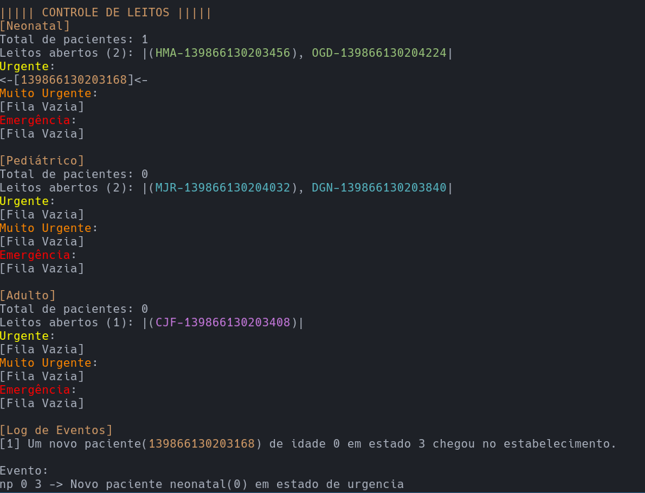

# SIMULADOR DE LEITOS



## Introdução
Este é o problema 2 do curso de Estrutura de Dados e Algoritmos da Universidade Federal da Bahia, ministrado pelo prof. Antonio Lopes Apolinario Jr. Neste documento, irei explicar como utilizar o simulador, algumas decisões de desenvolvimento e como, em geral, o simulador opera.

## Como Utilizar
Inicie o simulador com o comando ```python main.py``` em qualquer terminal. Este simulador não utiliza nenhuma dependência externa a não ser a biblioteca *random*, nativa do próprio python. 
O simulador iniciará e irá te apresentar com uma tela de ajuda, explicando brevemente como utilizá-lo.
Você pode apertar **[Enter]** para que um próximo evento aleatório seja gerado pelo simulador ou, alternativamente, você pode inserir um evento de sua escolha na linha de comando do próprio simulador. A estrutura dos eventos pode ser encontrada [aqui](#estrutura-dos-eventos--comandos).

## Decisões
Aqui estão listadas algumas decisões que foram feitas durante o desenvolvimento desta aplicação:
 - Pacientes que pioram em uma fila de prioridade n, mesmo que tenham chegado antes que um paciente que já estava na fila de prioridade n+1, irá para o final da fila de prioridade n+1. Ficou decidido desta forma pois um paciente que está a mais tempo em um estado mais grave deve ter a prioridade do leito.
 - A cada ciclo, o sistema irá te dar uma lista de eventos (logs) que aconteceram durante o tempo em que o último evento foi computado.
 - O Simulador é uma classe para que seja prática a reutilização do simulador em diferentes circunstâncias. Basta importar e instânciar a classe para utilizá-lo. 
 - O TAD utilizado para a organização dos pacientes foi uma fila customizada, implementada através de nós. Isso se deve por alguns motivos: Para que a ordem "FIFO" seja cumprida e para que a alocação seja dinâmica, rápida e com uma menor restrição sobre o tamanho. A parte customizada da fila é referente a necessidade de remover um paciente de uma posição arbitrária da fila caso este piore ou melhore.
 - O TAD utilizado para a organização dos leitos foi uma pilha simples. Esta escolha se deve devida a demanda que diz que os leitos mais recentemente disponibilizados devem ser os primeiros a serem ocupados (FILO).
 - O sistema reconhece a piora de um paciente em estado de emergência como uma morte. Dessa forma, este é removido da fila.
 - Analogamente, o sistema reconhece que se um paciente em estado de urgência melhora, este não precisa mais estar na fila. Dessa forma, este paciente também é removido da fila, priorizando novos pacientes em pior estado.
 - Leitos de uma faixa etária não podem ser utilizados por nenhuma outra idade.
 - Para que seja mais fácil a compreensão do que está acontecendo pelo usuário, além dos logs, toda vez que um evento é interpretado pelo sistema, este é "traduzido" para uma linguagem de mais fácil compreensão e impresso na tela, abaixo de "Evento".
 - Após todos os ciclos o  simulador irá checar se existem leitos que podem ser preenchidos. Estes espaços serão destinados aos pacientes de maior prioridade.
 - O sistema de prioridades funciona da seguinte forma: Um paciente terá uma prioridade maior que outro se este chegou antes ou está em um estado pior. Não existe prioridade entre idades, pois uma não pode ocupar o leito da outra. Dessa forma, se houver leitos disponíveis para uma idade x e pacientes de idade y estiverem esperando por leitos, um paciente y só será alocado se x for igual a y ou se existir algum leito para a idade y disponível.
 - Para ter um controle maior da simulação, decidi fazer com que o simulador só interprete o próximo evento após o comando do usuário. Isso se deve para que o usuário possa acompanhar melhor os eventos, além de abrir a possibilidade da interação direta com a simulação através de comandos/eventos inseridos em runtime.
 - Os pacientes são identificáveis pelos seus respectivos IDs, que são atribuídos quando criados.
 - Similarmente, os leitos são identificados através de um ID composto por 3 três letras e uma série de números. As letras servem para identificar o hospital que liberou o leito, enquanto os números para identificar o próprio leito.

## Estrutura dos eventos & Comandos
 - **Tipos de Eventos**
   - 'la' para indicar que um leito foi disponibilizado.
   - 'pp' para indicar que algum paciente da fila piorou.
   - 'pm' para indicar que algum paciente da fila melhorou.
   - 'np' para indicar que um novo paciente de idade *[Idade]* e gravidade *[Severidade]* chegou e precisa entrar em alguma das filas.
   - 'q' / 'quit' / 's' / 'sair' para sair do simulador.
   - 'h' / 'help' / 'a' / 'ajuda' para ver o guia de ajuda.
   - 'st' / 'status' / 'e' / 'estado' para ver o estado das filas. 
 - **Idades**
   - 'n' para Neonatal
   - 'p' para Pediátrico
   - 'a' para Adulto
   - 'r' para uma escolha aleatória
 - **Severidade**
   - '5' para Emergência
   - '4' para Muito urgente
   - '3' para Urgente
   - '2' para Pouco urgente
   - '1' para Não urgente
   - 'r' para uma escolha aleatória
 - **EXEMPLOS**
   - ```la p``` = Um leito para pacientes pediátricos foi disponibilizado.
   - ```pp``` = Algum paciente piorou.
   - ```np 9 5``` = Chegou um novo paciente de faixa etária pediátrica de gravidade 5 (Emergência).
   - ```20 la a``` = Repetir o comando ```la a``` 20 vezes.
   - ```20``` = Gerar e executar 20 comandos aleatórios.
   - ```10 np r r``` = Executar 'np' 10 vezes com idades e gravidades aleatórias.
